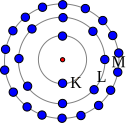
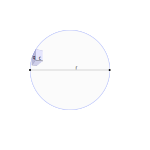

##A medium called Ether   

Does there exist a medium for electromagnetic waves? Similar as a water being the medium to pas water waves? 

### What's a name

**Perpetual motion** is motion of bodies that continues indefinitely. A **perpetual motion machine** is a hypothetical machine that can do work indefinitely without an energy source. This kind of machine is impossible, as it would violate the first or second law of thermodynamics. These laws of thermodynamics apply even at very grand scales. For example, the motions and rotations of celestial bodies such as planets may appear perpetual, but are actually subject to many processes that slowly dissipate their **kinetic energy**, such as *solar wind*, *interstellar medium* resistance, *gravitational radiation* and *thermal radiation*, so they will not keep moving forever.

When projecting this to the dimensions of an atom, suddenly perpetual motion **is** accepted. Electrons are moving around protons/neutrons at the speed of light. At this moment **Bohr's** atom model is accepted. This model, along every previous atom model, describes atoms as **perpetual mobiles**, and **is** accepted in science. 

All matter is made up of **atoms** and **molecules** that are constantly moving. When heat is added to a substance, the molecules and atoms vibrate faster. As atoms vibrate faster, the space between atoms increases. The motion and spacing of the particles determines the state of matter of the substance. The end result of increased molecular motion is that the object expands and takes up more space.

This definition explains clearly that atoms **can** and **will** absorb energy to reach a different state.   

###A failure due to misunderstanding?

>
> In the 19th century, physicists generally believed that just as water waves must have a medium to move across (water), and audible sound waves require a medium to move through (air), so also light waves require a medium, which was called the "luminiferous” (i.e. light-bearing) “ether”.
>
>Physicists had calculated that, as the Earth moved in its orbit around the sun, the flow of the ether across the Earth’s surface could produce a detectable "ether wind". Unless for some reason the ether were always stationary with respect to the Earth, the speed of a beam of light emitted from a source on Earth would depend on the magnitude of the ether wind and on the direction of the beam with respect to it. The idea of the experiment was to measure the speed of light in different directions in order to measure the speed of the ether relative to Earth, thus establishing its existence.
>
> The Michelson-Morley experiment became what might be regarded as the most famous failed experiment to date and is generally considered to be the first strong evidence against the existence of the luminiferous ether.
>

This experiment was indeed done, and without any succes. But this can also be explained due to the use of  a wrong model. Anyway, this thought  was banned.

## A new Ether model

The mode of ether as described by R. J. Distinti is a totally new approach. In This model the Ether is not a static medium, but the 'fuel' of charges and hence everything.  

Matter consumes ether. And since everything exist out of matter, and matter is build up out of 3 known particles, the electron, proton and neutron, these have to consume ether. A step lower on the echelon we can find charges, one positive, one negative. 

> This ethereal model is totally different to the model used in the 19e century. It is not only taking in account  the medium for light and EM waves, but also debunk the 'accepted' perpetual motion of atoms.  

Ether is the driving power of everything. We are no more than disturbances in the ethereal flow.

### Binary medium

To create a wave, there has to be a boundary between two types of media. You cannot create a wave with only water.  When throwing a stone  the ripple is visible on the surface of the water, on the boundary between the water and air. Sound waves can not be created with air, you need a string, a speaker or something else to create the vibration. The air will transmit this vibration and will be converted by your eardrum to sound.

The same is true with ether. Ether has to be a binary medium to be able to transmit waves.

 ### Basic description

Can the ether be described with the model of the ether as defined by R. Distinti? We going to give it a try starting with the 3 base formulations

- $F= k_e.\frac{q_s.q_t}{r^2}$

- $F= k_m.\frac{q_s.q_t}{r^2}[(v_t \cdot \vec{r}).v_s-(v_s \cdot \vec{r}).v_s - (v_s \cdot v_t).\vec{r}]$

- $F= -k_m.\frac{q_s.q_t}{r}.a.\vec{r}$

When replacing $k_e$ with $\mu_0.c^2$ and $k_m$ with $\mu_0$ and applying simplifications 

- $F= \mu_0.c^2.\frac{q_s.q_t}{r^2}$ = $F= \mu_0.\frac{c.q_s}{r}.\frac{c.q_t}{r}$
- $F= \mu_0.[(\frac{q_t}{r}v_t \cdot \vec{r}).\frac{q_s}{r} v_s-(\frac{q_s}{r}v_s \cdot \vec{r}).\frac{q_t}{r}v_s - (\frac{q_s}{r}v_s \cdot \frac{q_t}{r}v_t).\vec{r}]$
- $F= -\mu_0.\frac{q_s}{r}.q_t.a.\vec{r}$ 

As mentioned in other chapters, the part $c.q$ can be interpreted as the flow of ether towards the charge $[\frac{m^3}{s}]$. The part $\frac{c.q}{r}$ points to the ethereal flow at distance $r$  of the charge, which can also be defined as the current I $[\frac{m^2}{s}]$. With this in mind the formulas can be adapted even more specific.

- $F= \mu_0.\frac{c.q_s}{r}.\frac{c.q_t}{r}$
- $F= \mu_0.[(\frac{v_t.q_t}{r} \cdot \vec{r}).\frac{v_s.q_s}{r}-(\frac{v_s.q_s}{r} \cdot \vec{r}).\frac{v_s.q_s}{r} - (\frac{v_s.q_s}{r} \cdot \frac{v_t.q_t}{r}).\vec{r}]$
- $F= -\mu_0.\frac{q_s}{r}.q_t.a.\vec{r}$ 

The term $\frac{c.q}{r}$ points to a ratio between the speed of light c and a point at distance r. Can we state that the 

When we now implement the current I for each part:

- $F= \mu_0.I_{cs}.I_{ct}$ this seems to be similar to amperes 'law'
- $F= \mu_0.[(I_{vt} \cdot \vec{r}).I_{vs}-(I_{vs} \cdot \vec{r}).I_{vs} - (I_{vs} \cdot I_{vt}).\vec{r}]$
- $F= -\mu_0.\frac{q_s}{r}.q_t.a.\vec{r}$ 

current in the direction of the target, multiplied by the source current  $(I_{vt}.\vec{r}).I_{vs}$

current from the source in the direction of the target, multiplied by its own amplitude  $-(I_{vs}.\vec{r}).I_{vs}$

multiplication of both current in the direction of the distance $- (I_{vs}.I_{vt}).\vec{r}]$

For the acceleration we can modify the formula to fit in the current representation.

$F= \mu_0.\frac{q_s}{r}.q_t.\vec{a} = \mu_0.\frac{q_s}{r}.\frac{q_t}{r}.a.r.\vec{r}$   

Together with the formula for the  radial acceleration: $a = \frac{2.v^2}{r} \mapsto a.r = 2.v^2$ (taking in acount the radius is half the distance r)

$F= \mu_0.\frac{q_s}{r}.\frac{q_t}{r}.2.v^2 \vec{r}$

$F= \mu_0.2.\frac{v.q_s}{r}.\frac{v.q_t}{r}\vec{r}$

