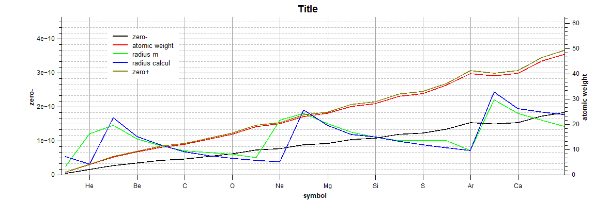

##Zero radius and the effect on covalent bonding

In the chapter of the charges the 'zero' radius $r_0$ was introduced as the radius wherein charges could not escape. Below this radius the speed of the ether is defined to be higher than the speed of light. This makes it difficult for a charge to escape.  

Next figure shows a plot derived from the atomic numbers, the empirically measured radius, the calculated radius and the $zero$ radius according the current understanding of the basic elements as found in Mendlejev's table. The $zero$ radius is calculated separately for the positive charges and negative charges. 

The number of protons  is equal to the atomic number (A), the number of neutrons is equal to the (rounded) atomic mass minus the protons. The  number of electrons is equal to the number of protons.

> $n_{proton} = A$
>
> $n_{electron} = n_{proton}$
>
> $n_{neutron} = m_{atom}-n_{proton}$

The blue line indicates the atomic empirically measured radius for each element. The 

##Chemical bonding, covalent bonding

The use of the zero radius can explain the nature of elements to bond with other elements.

Radiation

##Decay Alpha, beta, gamma x-ray and neutron radiation

Is there a possibility to define decay and radiation based on the ethereal model? Probably yes.

$\alpha$ decay -> atom number - 2

