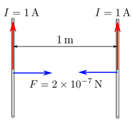

Ampere's second law

Definition of the Ampere:

The ampere is that constant current which, if maintained in two straight parallel conductors of infinite length, of negligible circular cross-section, and placed one meter apart in vacuum, would produce between these conductors a force equal to 2×10−7 newton per meter of length. 

$\frac{F}{m} = \mu_0\frac{I.I}{r}$

1. This definition is ambiguous because one of the current carrying conductors act as the originator of the magnetic field, and the other conductor acts for the current in the magnetic field. But the current in the second wire will also produce a magnetic field which will have it's influence on the first wire. 
2. How is this measurement executed? There are no balances yet which can measure 0.2$\mu N$ (converted to gram this is about 0.02 $\mu g$) this is only a calculation nothing more.

Amperes Law:
$B=\frac{\mu_0.I}{2.\pi.r}$ with  $\mu_0 = 4.\pi.10^{-7}$

together with:

$F=B.\Delta L.I$

$B=\frac{\mu_0.I}{2.\pi.r}$

