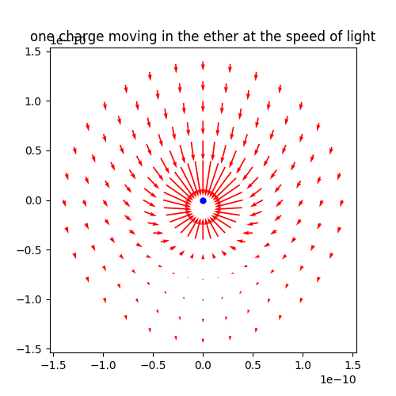
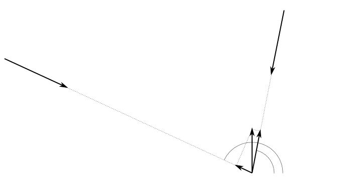

## Charge
A charge can be defined as a more elementary particle than the electron, proton or neutron (and perhaps the photon).  A charge has only two properties. It consumes ether, and it moves at the speed of light. The consumption of ether result in a movement of the charge.

As mentioned in the chapter of units, the currently used unit Coulomb [C], can be expressed as [$m^2$] . This opens a new perspective. Coulombs law can be rewritten as:

> $F=k_e \frac {(Q_1 Q_2)}{r^2} $ 

the relation between $k_e$ and $k_m$ is the following:

> $c^2 =\frac{k_e}{k_m}$

When changing  $k_e$ with $k_mc^2$ the formula can be modified as:

>$F=k_mc^2 \frac {(Q_1 Q_2)}{r^2} $  

In the paragraph of the units, it's explained that the $k_m$ or $\mu_0$  is only a scalar, introduced in the year 1831 by the Britisch Association because the unit of resistance was too low to work with. It is unit-less .

With this in mind the force between two equal charges q can be described as:

> $F=\mu_0.c^2\frac{q^2}{r^2}$ 

or finally:

> $F=\mu_0(\frac{c.q}{r})^2$ 

keep in mind the factor $\mu_0$ is only a scalar

> $F=\mu_0(\frac{c.q}{r})(\frac{c.q}{r})$  expressed in $\frac{m^4}{s^2}$ or $(\frac{m^2}{s})^2$

Therefore  it  is correct or describe half of the factor of the formula as :  $(\frac{c.q}{r})$ is expressed in $[\frac{m^2}{s}]$ (here we have found an analogy with the electric current I), one should taken in account that the current in this case depends in the distance from the charge and is not constant.

Something interesting can be found in the factor $c.q$, this turns out to be a flow, expressed in $[\frac{m^3}{s}]$. This is an indication that there is a consumption of a medium. A charge will consume an amount of ether.  If the velocity of the charge is equal to the speed of light, and the ether is consumed at the speed of light. We can define the radial distance from the charge where the velocity of the ether reaches the speed of light. The area of a surrounding sphere is defined by $q$. The radius can be calculated with the formula for the area of the sphere $A=4.\pi.r^2$ with the area equal to $q$. We will call this specific radius $r_0$.

> $q = 4.\pi.r_0^2$
>
> $r_0^2 = \frac{q}{4.\pi}$
>
> $r_0 = \sqrt{\frac{q}{4.\pi}}$ 
>
> $r_0$ is the so called zero radius

At radial distance is smaller than this zero radius $r_0$ the velocity of the ether should be higher than the speed of light. Charges coming loser to each other than this radial distance will be trapped by the ethereal flow. This is analogue to the **Schwarzschild radius**. 

As an example a charge of half the charge of an electron will be used, :

> $q = 8.01e^{-20} [m^2]$     (half the charge of an electron)
>
> $r_0 = \sqrt{\frac{q}{4.\pi}} = 7.98e^{-11} [m]$ The $r_0$ for half the electron charge
>
> $r_e = 2.8179403227e^{-15} [m]$ The electron radius as we know

The critical radius $r_0$ is more than $10000$ times bigger than the accepted radius of the electron. Below this radius, the speed of the ether is higher than the speed of light.

The figure shows a charge of $q = 8.01e^{-20} [m^2]$ as the blue dot at position (0,0), this charge moves upwards at the speed of light. From the point of view of the charge, the ether is approaching at the speed of light downwards, the red arrows indicate the speed of the ether flow when the charge consumes an amount of ether defined by $(c.q) [\frac{m^3}{s}]$. 

There is one point behind the moving charge, where the ether will be stationary with respect to the charge, this point lies at the distance $r_0$. 

If another charge is coming closer than this distance, it will be trapped because the speed of the ether will transcend the speed of light. If presumed an electron consist of two of this charges, they seem to be trapped inside each ethereal flow.

Charges do not have mass as we know it, the direction of velocity is **only** controlled by the ethereal flow. 

### Properties

### Single charge moving at the speed of light

Try to calculate back from the formula of coulomb:

> $F=\mu_0.(\frac{c.q}{r})2$
> $\frac{F}{\mu_0} = (\frac{c.q}{r})^2$
> $$

###System of 2 charges moving at the speed of light

This chapter will describe the behavior of two charges moving in parallel at the speed of light.

The flow of ether towards the system can be calculated as the sum of the flow needed for each individual charge. The obtained velocity at a distance 'r' is the total velocity available at this point. The scalar value of this velocity has to be the sum of the two individual scalar values.

> $v_t = v_a + v_b$ 

**Has to be clearified!** The velocity is defined by the radius, the question is if the velocity multiplied by the area, measured form the separate charges with respect to the sum of the charges. As a principle it is stated that the consumption of ether by each charge has to be constant. It should be verified if there is a condition where the sum of the charges, the velocity is in relation to the area of a sphere at this distance.

For the condition $r_a=r_b=\sqrt{2}r_t$

> $2.v_t.4.\pi.r_t^2 = v_a.4.\pi.r_a^2 +v_b.4.\pi.r_b^2$
> $2.v_t.r_t^2 = v_a.r_a^2 +v_b.r_b^2$
> $2.v_t.r_t^2 = 2.v_a.r_a^2$
> $2.v_t.r_t^2 = 2.v_a.2.r_t^2$
> $2.v_t = 4.v_a$
> $v_t= 2.v_a$

Take as point to refer to the real charges 'a' and 'b' and as center of the system 'c'. For the example we're using equal charges, for the system the charge will become 2.q .

> $v_c = \frac{c.q.2}{4.\pi.r_c^2}$

Take the normalized velocity calculation of the 2 charges, normalize it and give each charge a part of the velocity with respect to this normalization.

$Uab = Ua + Ub$

#### Parallel movements

#### Anti-parallel movement

The anti-parallel movement of two charges is a special case of system. In the previous systems the observer had to move at the speed of light to obtain the experience of a charge. In this mode the charges can be observed in a stationary ether.

### Ether is maybe a better approach to explain charges

Variation in ether is the cause of moving charges:

A charge will consume a certain amount of ether, this amount is a constant and for an electron this is q. The slightest variation (reduction) in ether flow will result in a movement in the opposite direction.

 charge consumes ether in all directions, tend to go to the highest ether density.

definitions:

`*is light nothing more than a movement of charge?* => no because the netto charge is not 0. `

